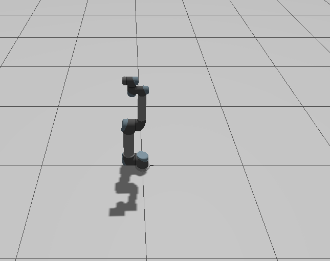

# UR5 Robot Arm Simulation

ROS 2 Jazzy simulation of the Universal Robots UR5 6-DOF industrial arm with a parallel-jaw gripper, overhead depth camera, point cloud box detection, and automated pick-and-place demo.



## Stack

| Component | Version |
|---|---|
| OS | Ubuntu 24.04 LTS |
| ROS 2 | Jazzy Jalisco |
| Simulator | Gazebo Harmonic (gz-sim 8) |
| Motion Planning | MoveIt 2 |
| ros2_control | Jazzy |

> **Development workflow:** files authored on Windows 11, pushed to GitHub, pulled and run on Ubuntu 24.04.

---

## What This Project Does

1. Spawns the UR5 arm with a custom parallel-jaw gripper in Gazebo
2. Overhead RGBD camera watches the workspace from above
3. Point cloud detector finds the box and publishes its 3D position
4. Pick-and-place script moves the arm to the box, grasps it, and places it at a target location
5. GUI dashboard shows live robot state and control buttons

---

## Prerequisites

### Ubuntu 24.04

**ROS 2 Jazzy** — follow the [official install guide](https://docs.ros.org/en/jazzy/Installation/Ubuntu-Install-Debs.html), then:

```bash
sudo apt install -y \
  ros-jazzy-ur \
  ros-jazzy-ur-simulation-gz \
  ros-jazzy-moveit \
  ros-jazzy-ros2-control \
  ros-jazzy-ros2-controllers \
  ros-jazzy-gz-ros2-control \
  ros-jazzy-ros-gz-bridge \
  ros-jazzy-tf2-sensor-msgs \
  python3-colcon-common-extensions
```

---

## Setup

```bash
mkdir -p ~/ros2/ros2-robot-arm-ur5/src
cd ~/ros2/ros2-robot-arm-ur5
git clone https://github.com/<your-username>/ros2-robot-arm src/ur5_simulation
colcon build --symlink-install
source install/setup.bash
```

---

## Running the Demo

### T1 — Launch everything (Gazebo + MoveIt + camera bridge)

```bash
source ~/ros2/ros2-robot-arm-ur5/install/setup.bash
ros2 launch ur5_simulation ur5_moveit.launch.py
```

Wait until Gazebo opens and the arm appears (about 15–20 seconds).

### T2 — Spawn the box

```bash
source ~/ros2/ros2-robot-arm-ur5/install/setup.bash
ros2 run ur5_simulation spawn_box
```

A small box appears at (0.5, 0.0, 0.025) in front of the arm.

### T3 — Start the box detector

```bash
source ~/ros2/ros2-robot-arm-ur5/install/setup.bash
ros2 run ur5_simulation box_detector
```

Logs `Box detected at (x, y, z)` when the camera sees the box.

### T4 — Run pick and place

```bash
source ~/ros2/ros2-robot-arm-ur5/install/setup.bash
ros2 run ur5_simulation pick_place
```

The arm opens its gripper, moves to the box using the detected position, grasps it, transports it, and places it at (0.3, -0.4, 0.025).

### Optional — GUI dashboard

```bash
source ~/ros2/ros2-robot-arm-ur5/install/setup.bash
ros2 run ur5_simulation dashboard
```

Opens a window showing live joint positions, gripper state, detected box XYZ, and buttons to control the robot.

---

## Package Structure

```
src/ur5_simulation/
├── package.xml                        # ROS 2 package dependencies
├── CMakeLists.txt                     # Build and install rules
├── urdf/
│   ├── ur5_with_gripper.urdf.xacro    # Full robot: UR5 + gripper + camera
│   └── simple_gripper.xacro           # Parallel-jaw gripper macro
├── config/
│   └── ur_controllers_gripper.yaml    # ros2_control: arm + gripper controllers
├── launch/
│   └── ur5_moveit.launch.py           # Main launch: Gazebo + MoveIt + bridge
└── scripts/
    ├── spawn_box.py                   # Spawns a box into Gazebo
    ├── box_detector.py                # Point cloud → box centroid publisher
    ├── pick_place.py                  # Full pick-and-place sequence
    ├── dashboard.py                   # Tkinter GUI dashboard
    └── move_ur5.py                    # Simple joint movement test
```

---

## Architecture

```
Gazebo (physics)
  │  gz_ros2_control plugin
  ▼
ros2_control
  ├── joint_trajectory_controller   → moves 6 arm joints
  └── gripper_controller            → moves 2 finger joints
        ↑
     MoveIt 2 (motion planning)
        ↑
     pick_place.py (sends joint goals)

Gazebo RGBD camera
  │  ros_gz_bridge
  ▼
/overhead_camera/points (PointCloud2)
  ↓
box_detector.py → /detected_box_pose (PointStamped)
  ↓
pick_place.py (uses detected XY to aim shoulder_pan)
```

---

## UR5 Joints

| Joint | Description |
|---|---|
| shoulder_pan_joint | Base rotation (yaw) |
| shoulder_lift_joint | First arm segment pitch |
| elbow_joint | Second arm segment pitch |
| wrist_1_joint | Wrist pitch |
| wrist_2_joint | Wrist roll |
| wrist_3_joint | Tool rotation |

---

## Known Limitations

- Gripper fingers have no collision geometry (MoveIt SRDF does not include gripper links — fingers pass through objects visually but the arm plans without collision errors)
- Gazebo Harmonic does not support URDF `<mimic>` joints — both fingers are commanded independently via `Float64MultiArray`
- Place target is hardcoded at (0.3, -0.4, 0.025)

---

## License

MIT
